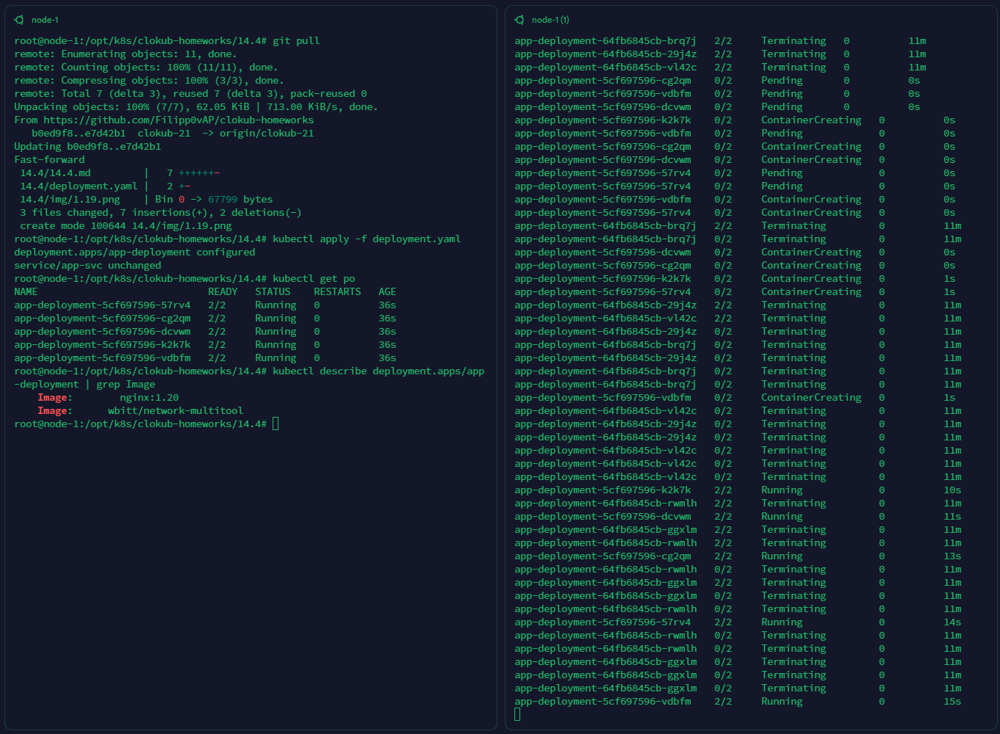

# Домашнее задание к занятию «Обновление приложений»

### Цель задания

Выбрать и настроить стратегию обновления приложения.

### Чеклист готовности к домашнему заданию

1. Кластер K8s.

### Инструменты и дополнительные материалы, которые пригодятся для выполнения задания

1. [Документация Updating a Deployment](https://kubernetes.io/docs/concepts/workloads/controllers/deployment/#updating-a-deployment).
2. [Статья про стратегии обновлений](https://habr.com/ru/companies/flant/articles/471620/).

-----

### Задание 1. Выбрать стратегию обновления приложения и описать ваш выбор

1. Имеется приложение, состоящее из нескольких реплик, которое требуется обновить.
2. Ресурсы, выделенные для приложения, ограничены, и нет возможности их увеличить.
3. Запас по ресурсам в менее загруженный момент времени составляет 20%.
4. Обновление мажорное, новые версии приложения не умеют работать со старыми.
5. Вам нужно объяснить свой выбор стратегии обновления приложения.

### Задание 2. Обновить приложение

1. Создать deployment приложения с контейнерами nginx и multitool. Версию nginx взять 1.19. Количество реплик — 5.
2. Обновить версию nginx в приложении до версии 1.20, сократив время обновления до минимума. Приложение должно быть доступно.
3. Попытаться обновить nginx до версии 1.28, приложение должно оставаться доступным.
4. Откатиться после неудачного обновления.

## Дополнительные задания — со звёздочкой*

Задания дополнительные, необязательные к выполнению, они не повлияют на получение зачёта по домашнему заданию. **Но мы настоятельно рекомендуем вам выполнять все задания со звёздочкой.** Это поможет лучше разобраться в материале.   

### Задание 3*. Создать Canary deployment

1. Создать два deployment'а приложения nginx.
2. При помощи разных ConfigMap сделать две версии приложения — веб-страницы.
3. С помощью ingress создать канареечный деплоймент, чтобы можно было часть трафика перебросить на разные версии приложения.

---

### Ответ:

### Задание 1. Выбрать стратегию обновления приложения и описать ваш выбор
Для обновления приложения в ограниченных ресурсах с новой мажорной версией, где новые версии не совместимы со старыми, и с учетом ограниченности ресурсов, предлагаю использовать стратегию Blue-Green деплоя.
Blue-Green деплоймент: Эта стратегия позволяет создать полностью отдельное окружение (Green) с новой версией приложения, которое может быть тщательно протестировано перед переключением трафика. Пока Green окружение не готово, трафик остается на текущем (Blue) окружении. После успешного тестирования Green окружения, трафик переключается с Blue на Green.

Обоснование выбора:
- Мажорное обновление: Поскольку новые версии приложения не совместимы со старыми, требуется переключение на новую версию сразу для всех реплик.

- Ограниченные ресурсы: Поскольку ресурсы ограничены, Blue-Green деплой позволяет минимизировать возможные негативные влияния на производительность. Основной ресурс будет использоваться только для одной версии приложения в каждый момент времени.

- Запас ресурсов: С учетом запаса в 20% в менее загруженный момент времени, можно поддерживать оба окружения (Blue и Green) параллельно, обеспечивая возможность быстрого отката в случае возникновения проблем.

- Минимизация длительности недоступности: Переключение между окружениями происходит мгновенно, минимизируя длительность недоступности приложения в процессе обновления.

### Задание 2. Обновить приложение
Для этой задачи я буду использовать RollingUpdate

1. Написал и применил [Манифест](./deployment.yaml) c nginx и multitool и 5 репликами.
    
    

2. Обновил до 1.20. Во время обновления приложение было доступно

    

3. Поднял версию до 1.28 и попытался обновиться. Обновление не получилось,  откатил обратно до 1.20

    

---
### Правила приёма работы

1. Домашняя работа оформляется в своем Git-репозитории в файле README.md. Выполненное домашнее задание пришлите ссылкой на .md-файл в вашем репозитории.
2. Файл README.md должен содержать скриншоты вывода необходимых команд, а также скриншоты результатов.
3. Репозиторий должен содержать тексты манифестов или ссылки на них в файле README.md.
